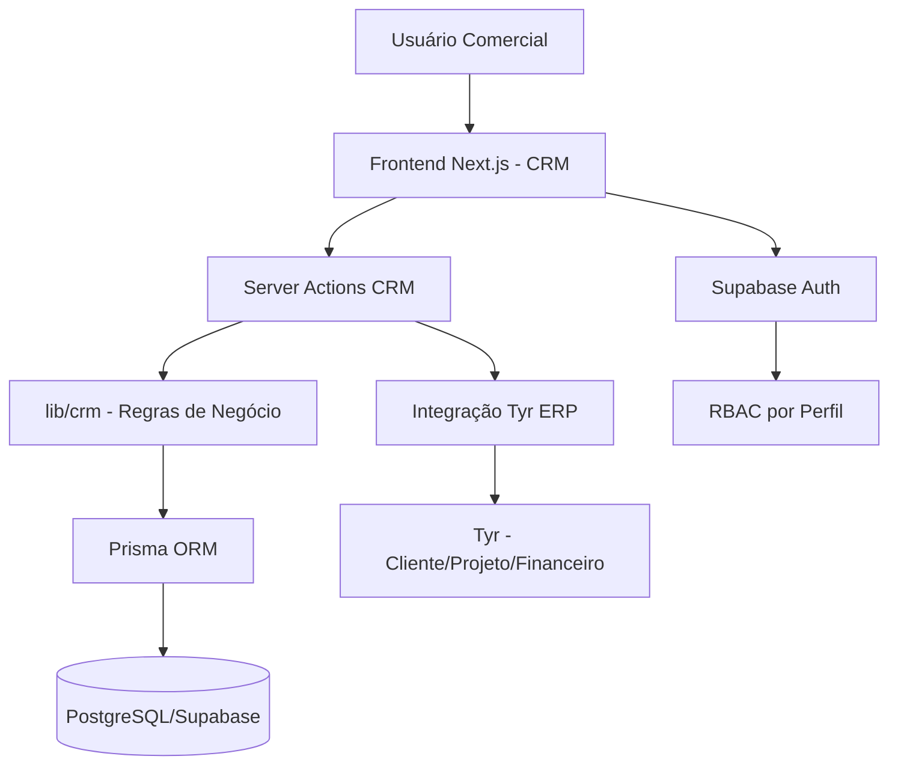

# ARQUITETURA.md — Arquitetura do Sistema

**Projeto:** Freya CRM  
**Atualizado em:** 07/07/2026  
**Status:** Planejamento / A confirmar

---

## 1. Visão Geral

O Freya CRM é um sistema comercial e de relacionamento com clientes destinado à gestão de leads, contatos, empresas, funil de vendas, oportunidades, atividades comerciais, propostas e conversão de oportunidades ganhas em clientes/projetos no Tyr ERP.

O sistema resolve a dor de centralizar e organizar o relacionamento comercial da empresa, desde a captação de leads até a conversão em cliente/projeto, oferecendo visibilidade de pipeline, previsibilidade de vendas e rastreabilidade de atividades.

O Freya deve nascer como produto/módulo independente em domínio de negócio, reaproveitando a arquitetura, stack, componentes visuais, padrões de autenticação, RBAC e infraestrutura do Tyr ERP (`Tyr_Controle`).

---

## 2. Stack Tecnológica Identificada

> **Observação:** A stack abaixo é a planejada conforme o documento de escopo. O repositório Freya-Crm ainda não possui código, `package.json` ou configuração. `PENDENTE DE VALIDAÇÃO` até a inicialização do projeto.

### Backend

- **Linguagem:** TypeScript (planejado)
- **Framework:** Next.js com App Router (planejado)
- **ORM:** Prisma (planejado)
- **Autenticação:** Supabase Auth (planejado)
- **Testes:** Vitest (planejado)

### Frontend

- **Linguagem:** TypeScript (planejado)
- **Framework:** React via Next.js App Router (planejado)
- **UI library:** Tailwind CSS, shadcn/ui, lucide-react (planejado)
- **Testes:** Playwright E2E (planejado)

### Banco de Dados

- **Banco:** PostgreSQL (planejado)
- **ORM / Query Builder:** Prisma (planejado)
- **Migrations:** Prisma Migrate (planejado)
- **Seeds:** Prisma Seed (planejado)

### Infraestrutura

- **Docker:** NÃO IDENTIFICADO NO REPOSITÓRIO
- **Deploy:** Vercel para aplicação, Supabase/PostgreSQL para banco (planejado)
- **CI/CD:** NÃO IDENTIFICADO NO REPOSITÓRIO
- **Observabilidade:** NÃO IDENTIFICADO NO REPOSITÓRIO

---

## 3. Estrutura de Pastas

> **Observação:** A estrutura abaixo é a sugerida no escopo. Nenhuma pasta existe ainda no repositório. `PENDENTE DE IMPLEMENTAÇÃO`.

```text
Freya-Crm/
├── src/
│   ├── app/
│   │   ├── (auth)/
│   │   ├── (protected)/
│   │   │   └── crm/
│   │   │       ├── dashboard/
│   │   │       ├── leads/
│   │   │       ├── empresas/
│   │   │       ├── contatos/
│   │   │       ├── oportunidades/
│   │   │       ├── funil/
│   │   │       ├── atividades/
│   │   │       ├── propostas/
│   │   │       ├── relatorios/
│   │   │       └── configuracoes/
│   │   └── actions/
│   │       ├── crm-leads.ts
│   │       ├── crm-companies.ts
│   │       ├── crm-contacts.ts
│   │       ├── crm-opportunities.ts
│   │       ├── crm-activities.ts
│   │       ├── crm-proposals.ts
│   │       └── crm-conversion.ts
│   ├── components/
│   │   └── crm/
│   │       ├── dashboard/
│   │       ├── leads/
│   │       ├── companies/
│   │       ├── contacts/
│   │       ├── opportunities/
│   │       ├── pipeline/
│   │       ├── activities/
│   │       ├── proposals/
│   │       └── shared/
│   └── lib/
│       └── crm/
│           ├── leads/
│           ├── companies/
│           ├── contacts/
│           ├── opportunities/
│           ├── activities/
│           ├── proposals/
│           ├── conversion/
│           ├── schemas.ts
│           ├── permissions.ts
│           └── queries.ts
├── prisma/
│   └── schema.prisma
├── tests/
│   ├── unit/
│   │   └── crm/
│   └── e2e/
│       └── crm/
├── package.json
├── README.md
├── AGENTS.md
├── ARQUITETURA.md
├── BANCO_DADOS.md
├── ESCOPO.md
├── ROADMAP.md
├── CONTEXTO.md
├── RELATORIO.md
└── escopo-freya-crm.md
```

### Função dos principais diretórios

| Diretório | Função |
|---|---|
| `src/app/(protected)/crm/` | Rotas protegidas do CRM (dashboard, leads, empresas, etc.) |
| `src/app/actions/` | Server Actions por domínio (crm-leads, crm-companies, etc.) |
| `src/components/crm/` | Componentes React específicos do CRM |
| `src/lib/crm/` | Regras de negócio, schemas Zod, queries, permissões e conversão |
| `prisma/` | Schema Prisma e migrations |
| `tests/` | Testes unitários (Vitest) e E2E (Playwright) |

---

## 4. Arquitetura Geral

### Estilo arquitetural

- **Monolito modular** com Next.js App Router
- **Server Actions** para lógica de backend (sem API REST separada no MVP)
- **Frontend SPA** com renderização server-side via Next.js
- **Domínio CRM isolado** em pastas, permissões e entidades com prefixo `Crm`
- **Integração direta** com Tyr ERP via services/Server Actions (MVP)

### Diagrama



---

## 5. Módulos do Sistema

### 5.1 Dashboard Comercial

- **Responsabilidade:** Visão executiva e operacional da área comercial com KPIs, gráficos e alertas.
- **Principais arquivos/pastas:** `src/app/(protected)/crm/dashboard/`, `src/components/crm/dashboard/`
- **Funcionalidades:** Leads novos por período, leads por origem/status, oportunidades abertas/ganhas/perdidas, valor potencial em pipeline, valor previsto por mês, taxa de conversão por etapa, tempo médio por etapa, atividades vencidas, próximos follow-ups, ranking de vendedores, forecast comercial.
- **Dependências:** Leads, Oportunidades, Atividades.
- **Status:** Pendente

### 5.2 Leads

- **Responsabilidade:** Cadastrar e acompanhar interessados antes de virarem oportunidade comercial.
- **Principais arquivos/pastas:** `src/app/(protected)/crm/leads/`, `src/app/actions/crm-leads.ts`, `src/lib/crm/leads/`
- **Funcionalidades:** CRUD de leads, filtros e busca, detecção de duplicidade, desqualificação com motivo, conversão em oportunidade, histórico de atividades, consentimento LGPD.
- **Dependências:** Usuários (responsável), Empresas (opcional), Contatos (opcional), Atividades.
- **Status:** Pendente

### 5.3 Empresas / Contas

- **Responsabilidade:** Representar empresas prospects, clientes potenciais ou clientes convertidos.
- **Principais arquivos/pastas:** `src/app/(protected)/crm/empresas/`, `src/app/actions/crm-companies.ts`, `src/lib/crm/companies/`
- **Funcionalidades:** CRUD de empresas, vínculo com contatos e oportunidades, vínculo com cliente Tyr após conversão, documento único.
- **Dependências:** Usuários (responsável comercial), Contatos, Oportunidades, Tyr (cliente vinculado).
- **Status:** Pendente

### 5.4 Contatos

- **Responsabilidade:** Registrar pessoas relacionadas a leads, empresas e oportunidades.
- **Principais arquivos/pastas:** `src/app/(protected)/crm/contatos/`, `src/app/actions/crm-contacts.ts`, `src/lib/crm/contacts/`
- **Funcionalidades:** CRUD de contatos, associação com empresa, associação com oportunidades, preferência de contato, consentimento/opt-out.
- **Dependências:** Empresas, Oportunidades.
- **Status:** Pendente

### 5.5 Funil de Vendas

- **Responsabilidade:** Organização visual das oportunidades por etapa comercial.
- **Principais arquivos/pastas:** `src/app/(protected)/crm/funil/`, `src/components/crm/pipeline/`
- **Funcionalidades:** Kanban de oportunidades, drag-and-drop entre etapas, reordenação, valor previsto por etapa, probabilidade por etapa, tempo na etapa, motivo de perda, alertas de oportunidade parada, histórico de mudança de etapa.
- **Dependências:** Oportunidades, Pipeline Stages.
- **Status:** Pendente

### 5.6 Oportunidades / Deals

- **Responsabilidade:** Controlar negociações comerciais com valor, etapa, previsão e responsável.
- **Principais arquivos/pastas:** `src/app/(protected)/crm/oportunidades/`, `src/app/actions/crm-opportunities.ts`, `src/lib/crm/opportunities/`
- **Funcionalidades:** CRUD de oportunidades, movimentação no funil, histórico de etapas, status ganho/perdido, motivo obrigatório de perda, conversão para Tyr.
- **Dependências:** Empresas, Contatos, Pipeline Stages, Usuários, Tyr (conversão).
- **Status:** Pendente

### 5.7 Atividades Comerciais

- **Responsabilidade:** Registrar ações de relacionamento e controlar follow-ups.
- **Principais arquivos/pastas:** `src/app/(protected)/crm/atividades/`, `src/app/actions/crm-activities.ts`, `src/lib/crm/activities/`
- **Funcionalidades:** CRUD de atividades, vínculo com lead/empresa/contato/oportunidade, conclusão, criação de próxima atividade, atividades vencidas no dashboard.
- **Dependências:** Leads, Empresas, Contatos, Oportunidades, Usuários.
- **Status:** Pendente

### 5.8 Propostas Comerciais

- **Responsabilidade:** Controlar propostas enviadas a prospects e oportunidades.
- **Principais arquivos/pastas:** `src/app/(protected)/crm/propostas/`, `src/app/actions/crm-proposals.ts`, `src/lib/crm/proposals/`
- **Funcionalidades:** Registro de propostas, vínculo com oportunidade, status, anexo/link de documento, histórico de envio/aprovação/recusa.
- **Dependências:** Oportunidades.
- **Status:** Pendente

### 5.9 Conversão para Tyr ERP

- **Responsabilidade:** Criar ponte controlada entre comercial e operação.
- **Principais arquivos/pastas:** `src/app/actions/crm-conversion.ts`, `src/lib/crm/conversion/`
- **Funcionalidades:** Marcar oportunidade como ganha, checklist de conversão, criar/vincular cliente no Tyr, criar projeto no Tyr, gerar registro financeiro inicial, vínculo entre oportunidade e entidade Tyr, auditoria da conversão.
- **Dependências:** Oportunidades, Empresas, Contatos, Tyr (cliente/projeto/financeiro).
- **Status:** Pendente

### 5.10 Customer Success / Pós-venda

- **Responsabilidade:** Acompanhar relacionamento após fechamento.
- **Principais arquivos/pastas:** A CONFIRMAR
- **Funcionalidades:** Visão de contas convertidas, histórico comercial e pós-venda, saúde do cliente, próxima reunião, risco de churn, oportunidades de upsell/cross-sell, NPS, observações.
- **Dependências:** Empresas convertidas, Tyr.
- **Status:** Pendente

---

## 6. Funcionalidades Existentes

> **Observação:** Nenhuma funcionalidade está implementada no repositório. Todas estão pendentes.

| Funcionalidade | Módulo | Status | Evidência no repositório |
|---|---|---|---|
| Nenhuma | — | — | Repositório sem código |

---

## 7. Funcionalidades Pendentes ou A Confirmar

| Funcionalidade | Motivo da pendência | Próxima ação |
|---|---|---|
| Dashboard Comercial | Sem código implementado | Inicializar projeto e criar Sprint 0 |
| CRUD de Leads | Sem código implementado | Sprint 1 |
| CRUD de Empresas | Sem código implementado | Sprint 1 |
| CRUD de Contatos | Sem código implementado | Sprint 1 |
| Funil de Vendas (Kanban) | Sem código implementado | Sprint 2 |
| CRUD de Oportunidades | Sem código implementado | Sprint 2 |
| Atividades Comerciais | Sem código implementado | Sprint 3 |
| Propostas Comerciais | Sem código implementado | Sprint 4 |
| Conversão Freya → Tyr | Sem código implementado | Sprint 4 |
| Dashboard e Relatórios | Sem código implementado | Sprint 5 |
| Customer Success / Pós-venda | Sem código implementado | Backlog futuro |
| Autenticação | Sem código implementado | Sprint 0 |
| RBAC CRM | Sem código implementado | Sprint 0 |

---

## 8. Fluxos Principais

### 8.1 Cadastro de Lead

- **Entrada:** Nome, email, telefone, empresa (opcional), origem, status, temperatura, responsável, consentimento LGPD.
- **Processamento:** Validação Zod → normalização de email/telefone → detecção de duplicidade → persistência via Prisma → auditoria.
- **Saída:** Lead criado com ID, status inicial `NOVO`.
- **Arquivos envolvidos:** `src/app/actions/crm-leads.ts`, `src/lib/crm/leads/`, `src/lib/crm/schemas.ts`, `prisma/schema.prisma`.
- **Possíveis erros:** Duplicidade detectada, campos obrigatórios ausentes, permissão negada.

### 8.2 Conversão de Lead em Oportunidade

- **Entrada:** Lead ID, dados iniciais da oportunidade (título, valor, etapa).
- **Processamento:** Validação de permissão → verificação de status do lead → criação de oportunidade vinculada → mudança de status do lead para `CONVERTIDO` → auditoria.
- **Saída:** Oportunidade criada no funil, lead marcado como convertido.
- **Arquivos envolvidos:** `src/app/actions/crm-leads.ts`, `src/app/actions/crm-opportunities.ts`, `src/lib/crm/conversion/`.
- **Possíveis erros:** Lead já convertido, permissão negada, etapa inválida.

### 8.3 Movimentação de Oportunidade no Funil

- **Entrada:** Oportunidade ID, nova etapa ID.
- **Processamento:** Validação de permissão → verificação de etapa final → registro no histórico de mudança → atualização da oportunidade → auditoria.
- **Saída:** Oportunidade na nova etapa, histórico registrado.
- **Arquivos envolvidos:** `src/app/actions/crm-opportunities.ts`, `src/lib/crm/opportunities/`.
- **Possíveis erros:** Etapa final não permite movimentação, permissão negada.

### 8.4 Marcar Oportunidade como Perdida

- **Entrada:** Oportunidade ID, motivo de perda (obrigatório).
- **Processamento:** Validação de permissão → exigir motivo → atualizar status para `PERDIDA` → registrar motivo → auditoria.
- **Saída:** Oportunidade perdida com motivo.
- **Arquivos envolvidos:** `src/app/actions/crm-opportunities.ts`.
- **Possíveis erros:** Motivo não informado, permissão negada.

### 8.5 Conversão de Oportunidade Ganha para Tyr

- **Entrada:** Oportunidade ID, dados mínimos para conversão (cliente, projeto, valor, tipo de cobrança).
- **Processamento:** Validação de permissão → checklist de conversão → criar/vincular cliente no Tyr → criar projeto no Tyr → gerar registro financeiro inicial → vínculo entre oportunidade e entidades Tyr → auditoria.
- **Saída:** Cliente/projeto criados no Tyr, oportunidade vinculada, histórico comercial preservado.
- **Arquivos envolvidos:** `src/app/actions/crm-conversion.ts`, `src/lib/crm/conversion/`.
- **Possíveis erros:** Cliente já existe (dedup), dados mínimos ausentes, falha transacional, permissão negada.

### 8.6 Criação e Conclusão de Atividade

- **Entrada:** Tipo, título, data/hora, responsável, entidade vinculada (lead/empresa/contato/oportunidade).
- **Processamento:** Validação Zod → persistência → vínculo com entidade. Conclusão: marcar como `CONCLUIDA` → opcionalmente criar próxima atividade.
- **Saída:** Atividade criada/concluída, próxima atividade criada se solicitado.
- **Arquivos envolvidos:** `src/app/actions/crm-activities.ts`.
- **Possíveis erros:** Entidade vinculada não existe, permissão negada.

---

## 9. Integrações Externas

| Integração | Finalidade | Onde é usada | Status | Observações |
|---|---|---|---|---|
| Tyr ERP | Conversão de oportunidade ganha em cliente/projeto/financeiro | `src/lib/crm/conversion/` | Planejada | Integração direta via services no MVP; API/webhooks no futuro |
| Supabase Auth | Autenticação de usuários | `src/app/(auth)/` | Planejada | Reaproveitado do Tyr |
| WhatsApp Business | Comunicação comercial | A CONFIRMAR | Backlog futuro | — |
| Email/SMTP | Envio de propostas e follow-ups | A CONFIRMAR | Backlog futuro | — |
| Google Calendar | Agendamento de atividades | A CONFIRMAR | Backlog futuro | — |
| Google Meet | Reuniões comerciais | A CONFIRMAR | Backlog futuro | — |
| Assinatura digital | Assinatura de propostas/contratos | A CONFIRMAR | Backlog futuro | — |

---

## 10. Segurança e Autenticação

### Modelo de autenticação

- Supabase Auth (planejado, reaproveitado do Tyr).
- Sessão baseada em JWT/cookies.

### Autorização / perfis

| Perfil | Descrição | Permissões principais |
|---|---|---|
| `ADMIN` | Administrador geral | Acesso total, configurações, usuários, integrações e auditoria |
| `VENDEDOR` | Usuário comercial | Gerencia leads, contatos, atividades e oportunidades próprias |

> **Observação:** Os perfis `GESTOR_COMERCIAL`, `CS` e `LEITURA` serão adicionados no futuro.

### Proteção de rotas

- Layout protegido em `src/app/(protected)/crm/` com verificação de sessão e RBAC.
- Server Actions validam permissão por ação.

### Validação de entrada

- Zod + React Hook Form no frontend.
- Validação no backend em todas as Server Actions.

### Riscos identificados

- Credenciais em documentação do Tyr (risco herdado) — remover e rotacionar antes de produção.
- Dados pessoais (LGPD) — necessária política de consentimento, opt-out e retenção desde o MVP.
- Logs não devem conter dados sensíveis em texto plano.

---

## 11. Build, Execução e Testes

> **Observação:** Comandos planejados. `PENDENTE DE VALIDAÇÃO` até a inicialização do projeto.

```bash
# instalação
npm install

# desenvolvimento
npm run dev

# lint
npm run lint

# testes unitários
npm run test

# testes E2E
npm run test:e2e

# build de produção
npm run build
```

### Comandos de banco (Prisma)

```bash
npx prisma migrate dev    # criar e aplicar migration em desenvolvimento
npx prisma migrate deploy # aplicar migrations em produção
npx prisma generate       # gerar cliente Prisma
npx prisma studio         # interface visual do banco
npx prisma db seed        # executar seeds
```

---

## 12. Pontos de Atenção Técnica

- **Débitos técnicos:** Repositório sem código inicial; toda a base técnica precisa ser criada.
- **Partes frágeis:** Integração Freya → Tyr é o fluxo mais crítico; precisa de transação, idempotência e rollback claro.
- **Falta de testes:** Sem testes configurados; propor configuração inicial de Vitest + Playwright na Sprint 0.
- **Módulos acoplados:** Risco de acoplamento entre CRM e ERP se a fronteira de domínio não for respeitada; usar prefixo `Crm` em entidades Prisma.
- **Riscos de escala:** Crescimento do monolito; preparar camada de integração para futura extração do CRM.
- **Riscos de segurança:** Credenciais em documentação do Tyr; dados pessoais sem política LGPD; permissões insuficientes.

---

## 13. Decisões Arquiteturais

| Data | Decisão | Motivo | Impacto |
|---|---|---|---|
| 07/07/2026 | Freya CRM em repositório próprio | Separação clara de produto comercial vs operacional | Deploy independente, integração com Tyr via API futura |
| 07/07/2026 | Stack baseada em Next.js + Prisma + PostgreSQL | Reaproveitamento de padrões do Tyr_Controle | Menor curva de aprendizado, componentes compartilháveis |
| 07/07/2026 | Prefixo `Crm` em entidades Prisma | Preservar separação de domínios Freya vs Tyr | Evita colisão de models e acoplamento |
| 07/07/2026 | Server Actions no MVP (sem API REST separada) | Simplicidade e velocidade de entrega | Pode evoluir para API interna se Freya for extraído |
| 07/07/2026 | RBAC com 2 perfis iniciais (ADMIN, VENDEDOR) | Simplificação para MVP | GESTOR_COMERCIAL, CS e LEITURA adicionados no futuro |
