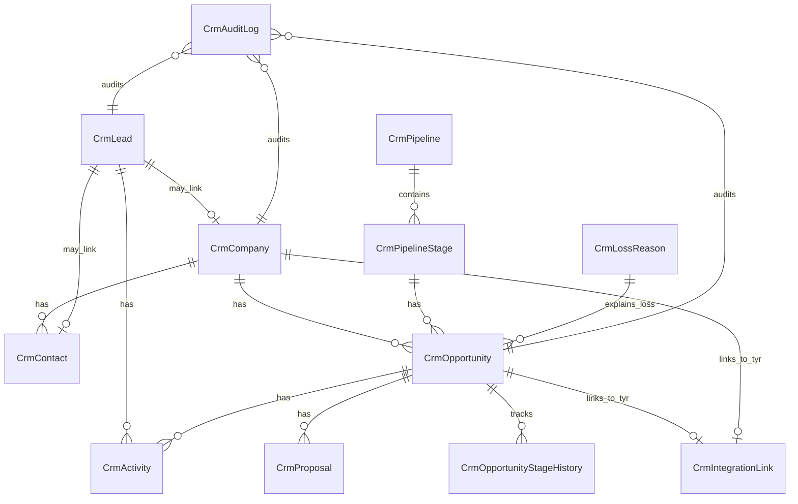

# BANCO_DADOS.md — Arquitetura de Banco de Dados

**Projeto:** Freya CRM  
**Atualizado em:** 07/07/2026  
**Banco identificado:** PostgreSQL (planejado)

---

## 1. Visão Geral

O banco de dados do Freya CRM armazena todas as entidades do domínio comercial: leads, empresas, contatos, funis, oportunidades, atividades, propostas, motivos de perda, auditoria e vínculos de integração com o Tyr ERP.

A tecnologia planejada é PostgreSQL via Supabase, com Prisma como ORM e Prisma Migrate para migrations. A estratégia de persistência segue o padrão do Tyr_Controle, com soft delete nas entidades principais e auditoria de ações críticas.

> **Observação:** Nenhuma migration, schema ou seed existe ainda no repositório. Tudo é proposta/pendente.

---

## 2. Tecnologia e Ferramentas

- **Banco:** PostgreSQL (planejado)
- **ORM:** Prisma (planejado)
- **Migration tool:** Prisma Migrate (planejado)
- **Seeds:** Prisma Seed (planejado)
- **Ambiente local:** PENDENTE DE VALIDAÇÃO
- **Ambiente produção:** Supabase / PostgreSQL (planejado)
- **String de conexão:** `NÃO DOCUMENTAR VALORES SENSÍVEIS`

---

## 3. Localização dos Arquivos de Banco

> **Observação:** Nenhum arquivo existe ainda. Estrutura planejada conforme o escopo.

| Tipo | Caminho | Observação |
|---|---|---|
| Schema Prisma | `prisma/schema.prisma` | Planejado |
| Migrations | `prisma/migrations/` | Planejado |
| Seeds | `prisma/seed.ts` | Planejado |
| Repositories / Queries | `src/lib/crm/queries.ts` | Planejado |
| Schemas Zod | `src/lib/crm/schemas.ts` | Planejado |
| Configuração de conexão | `src/lib/prisma.ts` | Planejado (reaproveitado do Tyr) |

---

## 4. Modelo Entidade-Relacionamento



---

## 5. Tabelas / Coleções

> **Observação:** Todas as tabelas abaixo são propostas no escopo. Nenhuma migration existe ainda. `PENDENTE DE IMPLEMENTAÇÃO`.

### `crm_leads`

**Finalidade:** Armazenar leads comerciais antes da conversão em oportunidade.  
**Arquivo/model relacionado:** `prisma/schema.prisma` (model `CrmLead`)  
**Migration de origem:** PENDENTE DE CRIAÇÃO

| Campo | Tipo | Obrigatório | Default | Chave | Observações |
|---|---|---|---|---|---|
| id | UUID/String | Sim | gen | PK | Identificador único |
| name | String | Sim | — | — | Nome do lead ou responsável |
| email | String? | Não | — | — | Validar formato; normalizar |
| phone | String? | Não | — | — | Normalizar formato |
| company_name | String? | Não | — | — | Empresa informada (texto livre) |
| company_id | UUID? | Não | — | FK | Vínculo opcional com `crm_companies` |
| position | String? | Não | — | — | Cargo do contato |
| source | Enum | Sim | — | — | Site, indicação, WhatsApp, LinkedIn, tráfego pago, evento, outbound, outro |
| status | Enum | Sim | NOVO | — | NOVO, CONTATADO, QUALIFICADO, DESQUALIFICADO, CONVERTIDO |
| temperature | Enum | Sim | FRIO | — | FRIO, MORNO, QUENTE |
| interest | String? | Não | — | — | Serviço/produto de interesse |
| notes | Text? | Não | — | — | Histórico inicial |
| owner_id | UUID | Sim | — | FK | Usuário responsável |
| next_follow_up | DateTime? | Não | — | — | Próximo follow-up |
| lgpd_consent | Boolean | Não | false | — | Consentimento LGPD |
| lgpd_consent_date | DateTime? | Não | — | — | Data do consentimento |
| created_at | DateTime | Sim | now() | — | Auditoria |
| updated_at | DateTime | Sim | now() | — | Auditoria |
| deleted_at | DateTime? | Não | — | — | Soft delete |

**Relacionamentos:**
- `crm_leads.company_id` → `crm_companies.id` (0:1)
- `crm_leads.owner_id` → `users.id`
- `crm_leads` 1:N `crm_activities`

**Índices:**
- `crm_leads.email`
- `crm_leads.phone`
- `crm_leads.status`
- `crm_leads.source`
- `crm_leads.owner_id`
- `crm_leads.created_at`

**Constraints:**
- Soft delete via `deleted_at`

**Regras importantes:**
- Lead pode existir sem empresa vinculada.
- Lead convertido não deve ser excluído fisicamente.
- Lead desqualificado deve exigir motivo.
- Duplicidade detectada por email, telefone ou empresa.

---

### `crm_companies`

**Finalidade:** Representar empresas prospects, clientes potenciais ou clientes convertidos.  
**Arquivo/model relacionado:** `prisma/schema.prisma` (model `CrmCompany`)  
**Migration de origem:** PENDENTE DE CRIAÇÃO

| Campo | Tipo | Obrigatório | Default | Chave | Observações |
|---|---|---|---|---|---|
| id | UUID/String | Sim | gen | PK | Identificador único |
| trade_name | String | Sim | — | — | Nome fantasia |
| legal_name | String? | Não | — | — | Razão social |
| document | String? | Não | — | Unique | CNPJ/CPF; único quando informado |
| website | String? | Não | — | — | URL do site |
| segment | String? | Não | — | — | Segmento de mercado |
| size | Enum? | Não | — | — | Porte da empresa |
| source | Enum? | Não | — | — | Origem |
| status | Enum | Sim | PROSPECT | — | PROSPECT, EM_NEGOCIACAO, CLIENTE_ATIVO, CLIENTE_INATIVO, PERDIDO, BLOQUEADO |
| address | Json? | Não | — | — | Endereço |
| notes | Text? | Não | — | — | Observações |
| owner_id | UUID | Sim | — | FK | Responsável comercial |
| tyr_client_id | UUID? | Não | — | FK | Vínculo opcional com cliente no Tyr |
| created_at | DateTime | Sim | now() | — | Auditoria |
| updated_at | DateTime | Sim | now() | — | Auditoria |
| deleted_at | DateTime? | Não | — | — | Soft delete |

**Relacionamentos:**
- `crm_companies` 1:N `crm_contacts`
- `crm_companies` 1:N `crm_opportunities`
- `crm_companies.owner_id` → `users.id`

**Índices:**
- `crm_companies.document` (unique)
- `crm_companies.trade_name`

**Constraints:**
- `document` único quando informado
- Soft delete via `deleted_at`

**Regras importantes:**
- Uma empresa pode ter múltiplos contatos e oportunidades.
- Empresa convertida pode gerar ou vincular cliente no Tyr.
- Dados sensíveis protegidos em logs.

---

### `crm_contacts`

**Finalidade:** Registrar pessoas relacionadas a leads, empresas e oportunidades.  
**Arquivo/model relacionado:** `prisma/schema.prisma` (model `CrmContact`)  
**Migration de origem:** PENDENTE DE CRIAÇÃO

| Campo | Tipo | Obrigatório | Default | Chave | Observações |
|---|---|---|---|---|---|
| id | UUID/String | Sim | gen | PK | Identificador único |
| name | String | Sim | — | — | Nome do contato |
| email | String? | Não | — | — | Normalizar |
| phone | String? | Não | — | — | Normalizar |
| position | String? | Não | — | — | Cargo |
| company_id | UUID? | Não | — | FK | Vínculo com `crm_companies` |
| linkedin | String? | Não | — | — | URL do LinkedIn |
| is_primary | Boolean | Não | false | — | Contato principal |
| contact_preference | Enum? | Não | — | — | Preferência de contato |
| lgpd_consent | Boolean | Não | false | — | Consentimento |
| lgpd_consent_date | DateTime? | Não | — | — | Data do consentimento |
| notes | Text? | Não | — | — | Observações |
| created_at | DateTime | Sim | now() | — | Auditoria |
| updated_at | DateTime | Sim | now() | — | Auditoria |
| deleted_at | DateTime? | Não | — | — | Soft delete |

**Relacionamentos:**
- `crm_contacts.company_id` → `crm_companies.id`
- `crm_contacts` N:N `crm_opportunities` (via tabela de junção)

**Índices:**
- `crm_contacts.email`
- `crm_contacts.phone`

**Constraints:**
- Soft delete via `deleted_at`

**Regras importantes:**
- Email e telefone normalizados para evitar duplicidade.
- Consentimento e opt-out respeitados em comunicações.

---

### `crm_pipelines`

**Finalidade:** Armazenar funis comerciais customizáveis.  
**Arquivo/model relacionado:** `prisma/schema.prisma` (model `CrmPipeline`)  
**Migration de origem:** PENDENTE DE CRIAÇÃO

| Campo | Tipo | Obrigatório | Default | Chave | Observações |
|---|---|---|---|---|---|
| id | UUID/String | Sim | gen | PK | Identificador único |
| name | String | Sim | — | — | Nome do funil |
| description | Text? | Não | — | — | Descrição |
| is_default | Boolean | Não | false | — | Funil padrão |
| created_at | DateTime | Sim | now() | — | Auditoria |
| updated_at | DateTime | Sim | now() | — | Auditoria |

**Relacionamentos:**
- `crm_pipelines` 1:N `crm_pipeline_stages`

---

### `crm_pipeline_stages`

**Finalidade:** Etapas do funil comercial.  
**Arquivo/model relacionado:** `prisma/schema.prisma` (model `CrmPipelineStage`)  
**Migration de origem:** PENDENTE DE CRIAÇÃO

| Campo | Tipo | Obrigatório | Default | Chave | Observações |
|---|---|---|---|---|---|
| id | UUID/String | Sim | gen | PK | Identificador único |
| pipeline_id | UUID | Sim | — | FK | Vínculo com `crm_pipelines` |
| name | String | Sim | — | — | Nome da etapa |
| order | Int | Sim | — | — | Ordem no funil |
| probability | Float? | Não | — | — | Probabilidade padrão (%) |
| is_final | Boolean | Não | false | — | Etapa final (ganho/perdido) |
| is_won | Boolean | Não | false | — | Etapa de ganho |
| is_lost | Boolean | Não | false | — | Etapa de perda |
| created_at | DateTime | Sim | now() | — | Auditoria |
| updated_at | DateTime | Sim | now() | — | Auditoria |

**Relacionamentos:**
- `crm_pipeline_stages.pipeline_id` → `crm_pipelines.id`
- `crm_pipeline_stages` 1:N `crm_opportunities`

**Etapas iniciais sugeridas:**
1. Entrada
2. Qualificação
3. Diagnóstico
4. Proposta
5. Negociação
6. Fechado ganho (final)
7. Fechado perdido (final)

---

### `crm_opportunities`

**Finalidade:** Controlar negociações comerciais com valor, etapa, previsão e responsável.  
**Arquivo/model relacionado:** `prisma/schema.prisma` (model `CrmOpportunity`)  
**Migration de origem:** PENDENTE DE CRIAÇÃO

| Campo | Tipo | Obrigatório | Default | Chave | Observações |
|---|---|---|---|---|---|
| id | UUID/String | Sim | gen | PK | Identificador único |
| title | String | Sim | — | — | Título da oportunidade |
| company_id | UUID | Sim | — | FK | Vínculo com `crm_companies` |
| contact_id | UUID? | Não | — | FK | Contato principal |
| lead_id | UUID? | Não | — | FK | Lead de origem |
| owner_id | UUID | Sim | — | FK | Responsável |
| stage_id | UUID | Sim | — | FK | Etapa atual no funil |
| status | Enum | Sim | ABERTA | — | ABERTA, GANHA, PERDIDA, CANCELADA, CONGELADA |
| estimated_value | Decimal | Sim | — | — | Valor estimado (>= 0) |
| probability | Float? | Não | — | — | Probabilidade (%) |
| expected_close_date | DateTime? | Não | — | — | Data prevista de fechamento |
| service | String? | Não | — | — | Serviço/produto |
| priority | Enum? | Não | — | — | Prioridade |
| description | Text? | Não | — | — | Descrição |
| loss_reason_id | UUID? | Não | — | FK | Motivo de perda (obrigatório se perdida) |
| loss_reason_note | Text? | Não | — | — | Nota sobre perda |
| created_at | DateTime | Sim | now() | — | Auditoria |
| updated_at | DateTime | Sim | now() | — | Auditoria |
| deleted_at | DateTime? | Não | — | — | Soft delete |

**Relacionamentos:**
- `crm_opportunities.company_id` → `crm_companies.id`
- `crm_opportunities.contact_id` → `crm_contacts.id`
- `crm_opportunities.lead_id` → `crm_leads.id`
- `crm_opportunities.owner_id` → `users.id`
- `crm_opportunities.stage_id` → `crm_pipeline_stages.id`
- `crm_opportunities.loss_reason_id` → `crm_loss_reasons.id`
- `crm_opportunities` 1:N `crm_activities`
- `crm_opportunities` 1:N `crm_proposals`
- `crm_opportunities` 1:N `crm_opportunity_stage_history`
- `crm_opportunities` 0:1 `crm_integration_links`

**Índices:**
- `crm_opportunities.status`
- `crm_opportunities.stage_id`
- `crm_opportunities.owner_id`
- `crm_opportunities.expected_close_date`

**Constraints:**
- `estimated_value >= 0`
- `loss_reason_id` obrigatório quando `status = PERDIDA`
- Soft delete via `deleted_at`

**Regras importantes:**
- Oportunidade deve pertencer a uma empresa ou lead convertido.
- Oportunidade ganha pode criar cliente/projeto no Tyr.
- Oportunidade perdida deve registrar motivo.
- Alterações críticas devem ser auditadas.

---

### `crm_opportunity_stage_history`

**Finalidade:** Histórico de mudanças de etapa das oportunidades.  
**Arquivo/model relacionado:** `prisma/schema.prisma` (model `CrmOpportunityStageHistory`)  
**Migration de origem:** PENDENTE DE CRIAÇÃO

| Campo | Tipo | Obrigatório | Default | Chave | Observações |
|---|---|---|---|---|---|
| id | UUID/String | Sim | gen | PK | Identificador único |
| opportunity_id | UUID | Sim | — | FK | Vínculo com `crm_opportunities` |
| from_stage_id | UUID? | Não | — | FK | Etapa anterior |
| to_stage_id | UUID | Sim | — | FK | Nova etapa |
| changed_by | UUID | Sim | — | FK | Usuário que fez a mudança |
| changed_at | DateTime | Sim | now() | — | Momento da mudança |
| note | Text? | Não | — | — | Observação |

**Relacionamentos:**
- `crm_opportunity_stage_history.opportunity_id` → `crm_opportunities.id`
- `from_stage_id` / `to_stage_id` → `crm_pipeline_stages.id`
- `changed_by` → `users.id`

---

### `crm_activities`

**Finalidade:** Registrar atividades comerciais (ligações, reuniões, follow-ups, etc.).  
**Arquivo/model relacionado:** `prisma/schema.prisma` (model `CrmActivity`)  
**Migration de origem:** PENDENTE DE CRIAÇÃO

| Campo | Tipo | Obrigatório | Default | Chave | Observações |
|---|---|---|---|---|---|
| id | UUID/String | Sim | gen | PK | Identificador único |
| type | Enum | Sim | — | — | LIGACAO, WHATSAPP, EMAIL, REUNIAO, DEMONSTRACAO, PROPOSTA, FOLLOW_UP, TAREFA, NOTA, OUTRO |
| title | String | Sim | — | — | Título da atividade |
| description | Text? | Não | — | — | Descrição |
| scheduled_at | DateTime | Sim | — | — | Data/hora agendada |
| status | Enum | Sim | PENDENTE | — | PENDENTE, CONCLUIDA, CANCELADA, ATRASADA |
| owner_id | UUID | Sim | — | FK | Responsável |
| lead_id | UUID? | Não | — | FK | Vínculo com lead |
| company_id | UUID? | Não | — | FK | Vínculo com empresa |
| contact_id | UUID? | Não | — | FK | Vínculo com contato |
| opportunity_id | UUID? | Não | — | FK | Vínculo com oportunidade |
| result | Text? | Não | — | — | Resultado da atividade |
| next_action | Text? | Não | — | — | Próxima ação sugerida |
| created_at | DateTime | Sim | now() | — | Auditoria |
| updated_at | DateTime | Sim | now() | — | Auditoria |

**Relacionamentos:**
- `crm_activities.owner_id` → `users.id`
- `crm_activities.lead_id` → `crm_leads.id`
- `crm_activities.company_id` → `crm_companies.id`
- `crm_activities.contact_id` → `crm_contacts.id`
- `crm_activities.opportunity_id` → `crm_opportunities.id`

**Índices:**
- `crm_activities.status`
- `crm_activities.scheduled_at`
- `crm_activities.owner_id`

**Regras importantes:**
- Atividade deve estar vinculada a pelo menos uma entidade.
- Histórico não deve ser apagado fisicamente.

---

### `crm_proposals`

**Finalidade:** Controlar propostas enviadas a prospects e oportunidades.  
**Arquivo/model relacionado:** `prisma/schema.prisma` (model `CrmProposal`)  
**Migration de origem:** PENDENTE DE CRIAÇÃO

| Campo | Tipo | Obrigatório | Default | Chave | Observações |
|---|---|---|---|---|---|
| id | UUID/String | Sim | gen | PK | Identificador único |
| opportunity_id | UUID | Sim | — | FK | Vínculo com `crm_opportunities` |
| code | String | Sim | — | Unique | Código da proposta |
| title | String | Sim | — | — | Título |
| value | Decimal | Sim | — | — | Valor da proposta |
| valid_until | DateTime? | Não | — | — | Validade |
| status | Enum | Sim | RASCUNHO | — | RASCUNHO, ENVIADA, EM_NEGOCIACAO, APROVADA, RECUSADA, EXPIRADA, CANCELADA |
| document_url | String? | Não | — | — | Link/documento |
| notes | Text? | Não | — | — | Observações |
| sent_at | DateTime? | Não | — | — | Data de envio |
| approved_at | DateTime? | Não | — | — | Data de aprovação |
| rejected_at | DateTime? | Não | — | — | Data de recusa |
| created_at | DateTime | Sim | now() | — | Auditoria |
| updated_at | DateTime | Sim | now() | — | Auditoria |

**Relacionamentos:**
- `crm_proposals.opportunity_id` → `crm_opportunities.id`

---

### `crm_loss_reasons`

**Finalidade:** Motivos padronizados de perda de oportunidade.  
**Arquivo/model relacionado:** `prisma/schema.prisma` (model `CrmLossReason`)  
**Migration de origem:** PENDENTE DE CRIAÇÃO

| Campo | Tipo | Obrigatório | Default | Chave | Observações |
|---|---|---|---|---|---|
| id | UUID/String | Sim | gen | PK | Identificador único |
| name | String | Sim | — | — | Nome do motivo |
| description | Text? | Não | — | — | Descrição |
| is_active | Boolean | Não | true | — | Ativo/inativo |
| created_at | DateTime | Sim | now() | — | Auditoria |

**Relacionamentos:**
- `crm_loss_reasons` 1:N `crm_opportunities`

---

### `crm_audit_logs`

**Finalidade:** Auditoria de ações críticas no CRM.  
**Arquivo/model relacionado:** `prisma/schema.prisma` (model `CrmAuditLog`)  
**Migration de origem:** PENDENTE DE CRIAÇÃO

| Campo | Tipo | Obrigatório | Default | Chave | Observações |
|---|---|---|---|---|---|
| id | UUID/String | Sim | gen | PK | Identificador único |
| entity_type | String | Sim | — | — | Tipo da entidade (Lead, Opportunity, etc.) |
| entity_id | UUID | Sim | — | — | ID da entidade |
| action | String | Sim | — | — | Ação realizada (CREATE, UPDATE, DELETE, CONVERT, STATUS_CHANGE) |
| performed_by | UUID | Sim | — | FK | Usuário que executou |
| details | Json? | Não | — | — | Detalhes da ação (sem dados sensíveis) |
| created_at | DateTime | Sim | now() | — | Momento da ação |

**Relacionamentos:**
- `performed_by` → `users.id`

**Regras importantes:**
- Logs não devem conter dados sensíveis em texto plano.
- Auditoria para conversão, exclusão, alteração de status final e alteração de responsável.

---

### `crm_integration_links`

**Finalidade:** Vínculos entre entidades do Freya e entidades do Tyr ERP.  
**Arquivo/model relacionado:** `prisma/schema.prisma` (model `CrmIntegrationLink`)  
**Migration de origem:** PENDENTE DE CRIAÇÃO

| Campo | Tipo | Obrigatório | Default | Chave | Observações |
|---|---|---|---|---|---|
| id | UUID/String | Sim | gen | PK | Identificador único |
| freya_entity_type | String | Sim | — | — | Tipo da entidade no Freya (Opportunity, Company) |
| freya_entity_id | UUID | Sim | — | — | ID da entidade no Freya |
| tyr_entity_type | String | Sim | — | — | Tipo da entidade no Tyr (Client, Project) |
| tyr_entity_id | UUID | Sim | — | — | ID da entidade no Tyr |
| external_id | String? | Não | — | — | ID externo para idempotência |
| created_at | DateTime | Sim | now() | — | Auditoria |

**Relacionamentos:**
- Vínculo lógico com entidades do Tyr (não FK física se bancos separados)

**Regras importantes:**
- Não deve duplicar cliente se documento/email já existir.
- Conversão deve gerar vínculo e histórico.

---

## 6. Migrações

> **Observação:** Nenhuma migration existe ainda no repositório.

| Ordem | Arquivo | Descrição | Status |
|---|---|---|---|
| 001 | `prisma/migrations/001_init_crm/` | Criação das tabelas base do CRM | PENDENTE DE CRIAÇÃO |
| 002 | `prisma/migrations/002_seed_pipeline/` | Seed do pipeline padrão | PENDENTE DE CRIAÇÃO |

### Como rodar migrations

```bash
npx prisma migrate dev    # desenvolvimento
npx prisma migrate deploy # produção
```

### Como reverter migrations

- Prisma Migrate não suporta rollback automático de forma simples.
- Política: criar nova migration corretiva quando necessário.
- **Nunca editar migration já aplicada em produção.**

### Cuidados

- Sempre testar migration em ambiente de desenvolvimento antes de produção.
- Fazer backup do banco antes de migrations destrutivas em produção.
- Validar seeds após migration.

---

## 7. Seeds e Dados Iniciais

> **Observação:** Nenhum seed existe ainda.

| Arquivo | Dados criados | Status |
|---|---|---|
| `prisma/seed.ts` | Pipeline padrão com 7 etapas, motivos de perda iniciais | PENDENTE DE CRIAÇÃO |

### Pipeline padrão sugerido para seed

1. Entrada
2. Qualificação
3. Diagnóstico
4. Proposta
5. Negociação
6. Fechado ganho (final)
7. Fechado perdido (final)

### Como executar seeds

```bash
npx prisma db seed
```

---

## 8. Repositórios, Queries e Acesso a Dados

### Camada de acesso a dados

- **Prisma Client** como ORM principal.
- **Server Actions** como camada de serviço que chama o Prisma.
- **Queries centralizadas** em `src/lib/crm/queries.ts` para consultas reutilizáveis.
- **Schemas Zod** em `src/lib/crm/schemas.ts` para validação antes de persistir.

### Padrões usados

- Soft delete via campo `deleted_at` (não exclusão física).
- Auditoria via `crm_audit_logs` para ações críticas.
- Normalização de email, telefone e documento antes de persistir.

### Queries críticas

- Detecção de duplicidade de leads (por email, telefone, empresa).
- Cálculo de forecast (soma de oportunidades abertas ponderadas por probabilidade).
- Listagem de atividades vencidas por responsável.
- Valor total aberto por etapa do funil.
- Ranking de vendedores por oportunidades ganhas.

### Pontos de performance

- Paginação obrigatória em listagens.
- Filtros indexados em queries de listagem.
- Evitar N+1 queries em listagens com relacionamentos.

---

## 9. Índices e Performance

| Tabela | Índice | Campos | Motivo |
|---|---|---|---|
| `crm_leads` | idx_leads_email | email | Detecção de duplicidade e busca |
| `crm_leads` | idx_leads_phone | phone | Detecção de duplicidade e busca |
| `crm_leads` | idx_leads_status | status | Filtro de listagem |
| `crm_leads` | idx_leads_source | source | Filtro de listagem |
| `crm_leads` | idx_leads_owner | owner_id | Filtro por responsável |
| `crm_leads` | idx_leads_created | created_at | Ordenação por data |
| `crm_companies` | idx_companies_document | document (unique) | Deduplicação |
| `crm_companies` | idx_companies_name | trade_name | Busca por nome |
| `crm_contacts` | idx_contacts_email | email | Detecção de duplicidade |
| `crm_contacts` | idx_contacts_phone | phone | Detecção de duplicidade |
| `crm_opportunities` | idx_opp_status | status | Filtro de listagem |
| `crm_opportunities` | idx_opp_stage | stage_id | Filtro de funil |
| `crm_opportunities` | idx_opp_owner | owner_id | Filtro por responsável |
| `crm_opportunities` | idx_opp_close_date | expected_close_date | Filtro por período |
| `crm_activities` | idx_act_status | status | Filtro de atividades vencidas |
| `crm_activities` | idx_act_scheduled | scheduled_at | Ordenação por data |
| `crm_activities` | idx_act_owner | owner_id | Filtro por responsável |

---

## 10. Integridade, Constraints e Validações

### Foreign keys

- Todas as relações 1:N e N:1 com FK explícita no schema Prisma.
- Vínculos com Tyr via `crm_integration_links` (não FK física se bancos separados).

### Unique constraints

- `crm_companies.document` — único quando informado.
- `crm_proposals.code` — único.

### Checks

- `crm_opportunities.estimated_value >= 0` (validação na aplicação).

### Cascades

- Soft delete preferido sobre cascade físico.
- Exclusão de empresa não deve excluir contatos/opportunidades fisicamente.

### Soft delete

- Campos `deleted_at` em: `crm_leads`, `crm_companies`, `crm_contacts`, `crm_opportunities`.
- Queries devem filtrar `deleted_at IS NULL` por padrão.

### Timestamps

- `created_at` e `updated_at` em todas as entidades principais.
- `updated_at` atualizado automaticamente via middleware Prisma ou trigger.

### Auditoria

- `crm_audit_logs` registra ações críticas: conversão, exclusão, alteração de status final, alteração de responsável.
- Detalhes em JSON sem dados sensíveis.

---

## 11. Segurança dos Dados

### Dados sensíveis

- Nome, email, telefone, cargo, empresa, histórico de comunicação, origem do lead, preferências de contato, consentimento/opt-out, observações comerciais.

### LGPD

- Campos de consentimento (`lgpd_consent`, `lgpd_consent_date`) em leads e contatos.
- Controle de opt-out em contatos.
- Política de retenção a ser definida.
- Exportação/remoção futura de dados por titular.

### Criptografia / hash

- Senhas gerenciadas pelo Supabase Auth (não no schema do CRM).
- Dados sensíveis não devem aparecer em logs.

### Controle de acesso

- RBAC por perfil (ADMIN, GESTOR_COMERCIAL, VENDEDOR, CS, LEITURA).
- VENDEDOR vê apenas leads/oportunidades próprios.
- Validação de permissão em todas as Server Actions.

### RLS (Row Level Security)

- A CONFIRMAR — verificar se Supabase RLS será utilizado.

### Backups

- PENDENTE DE VALIDAÇÃO — estratégia de backup a ser definida com Supabase.

### Logs

- Logs de auditoria em `crm_audit_logs` sem dados sensíveis em texto plano.

---

## 12. Pendências e Riscos

| Item | Risco | Severidade | Ação recomendada |
|---|---|---|---|
| Schema Prisma não criado | Sem banco funcional | Alta | Criar `prisma/schema.prisma` na Sprint 0 |
| Migrations não criadas | Sem persistência | Alta | Criar migration inicial na Sprint 0 |
| Seeds não criados | Sem dados iniciais | Média | Criar seed de pipeline padrão na Sprint 0 |
| Política de retenção LGPD não definida | Risco legal | Alta | Definir política antes de produção |
| RLS não confirmado | Risco de acesso indevido | Média | Avaliar RLS no Supabase |
| Estratégia de backup não definida | Risco de perda de dados | Alta | Definir backup com Supabase |
| Integração com Tyr não implementada | Conversão sem vínculo | Alta | Implementar `crm_integration_links` na Sprint 4 |
| Normalização de email/telefone | Duplicidade de dados | Média | Implementar normalização antes de persistir |
